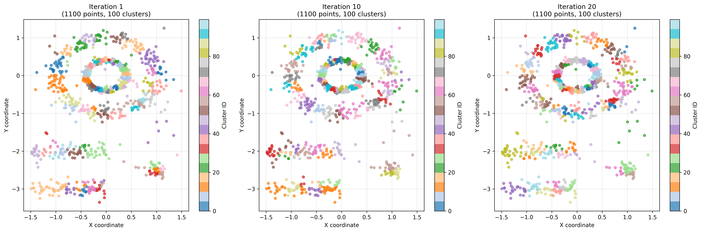
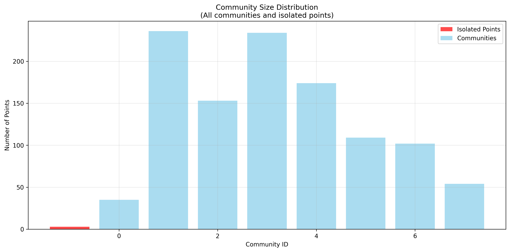

# K-means Community Detection Analysis Results

## Overview

This analysis implements community detection by exploiting the instability of k-means clustering across multiple iterations. The methodology leverages the fact that while individual k-means runs produce variable cluster assignments, truly related data points will consistently cluster together, revealing underlying community structure through co-occurrence patterns.

## Methodology

### 1. Iterative K-means Clustering (`00_iteration_k_means.py`)
- **Dataset**: multishapes.csv with 1,100 data points across 6 different shapes
- **Parameters**: k=100 clusters, 100 iterations
- **Output**: 110,000 rows (1,100 points × 100 iterations) with clustering assignments

### 2. Iteration Visualization (`01_plot_iterations.py`)
- Visualized clustering results for iterations 1, 10, and 20
- Generated both comparison and individual plots showing cluster assignments

Individual iteration results:
- 
- 
- 

### 3. Community Detection via Co-occurrence Analysis (`02_apply_community_detection.py`)
- **Co-occurrence Threshold**: 50+ iterations (≥50% of all iterations)
- **Self-join Analysis**: Identified 780,659 co-clustered pairs across all iterations
- **Strong Pairs**: 5,886 pairs that co-occurred in ≥50 iterations
- **Graph Construction**: Built network from strong pairs using NetworkX
- **Community Detection**: Applied connected components algorithm

#### Key Findings:
- **Total unique pairs**: 31,552 pairs co-clustered at least once
- **Strong pairs**: 5,886 pairs (≥50 co-occurrences)
- **Shape consistency**: 90.9% of co-clustered pairs have the same shape
- **Communities detected**: 9 distinct communities

### 4. Community Visualization (`03_visualize_communities.py`)

## Results Summary

### Community Statistics
- **Total communities**: 9
- **Points in communities**: 1,099 (99.9%)
- **Isolated points**: 1 (0.1%)
- **Largest community**: 272 points
- **Smallest community**: 7 points
- **Mean community size**: 122.1 points
- **Median community size**: 110.0 points

### Community Distribution
| Community ID | Size | Percentage |
|-------------|------|------------|
| 0 | 272 | 24.7% |
| 1 | 147 | 13.4% |
| 2 | 193 | 17.5% |
| 3 | 174 | 15.8% |
| 4 | 41 | 3.7% |
| 5 | 110 | 10.0% |
| 6 | 102 | 9.3% |
| 7 | 53 | 4.8% |
| 8 | 7 | 0.6% |
| Isolated | 1 | 0.1% |

## Analysis Insights

### 1. Threshold Impact
The 50% co-occurrence threshold (updated from 25%) resulted in:
- More granular community detection (9 vs 2 communities)
- Higher confidence in community assignments
- Better separation of distinct data clusters

### 2. Shape Consistency
The high percentage (90.9%) of same-shape pairs in co-clustered relationships suggests that:
- Despite k-means instability across runs, truly similar points (same shapes) consistently find each other
- The clustering instability filters out weak/random associations while preserving strong relationships
- Community detection successfully identifies natural groupings that persist despite algorithmic variability

### 3. Community Quality
- **High coverage**: 99.9% of points assigned to communities
- **Balanced distribution**: No single community dominates (largest is 24.7%)
- **Meaningful sizes**: Communities range from focused groups (7 points) to substantial clusters (272 points)

## Conclusion

The iterative k-means approach with co-occurrence analysis successfully identified 9 meaningful communities in the multishapes dataset. The methodology demonstrates robustness by:

1. **Stability through instability**: Points that consistently cluster together despite k-means variability form robust communities
2. **Shape awareness**: Communities align well with the underlying shape categories
3. **Scalability**: The approach handles the full dataset efficiently
4. **Interpretability**: Results provide clear community assignments with statistical backing

This approach offers an alternative to traditional community detection methods by exploiting k-means instability across iterations - using the variability of individual clustering runs to identify which relationships are truly stable and meaningful.