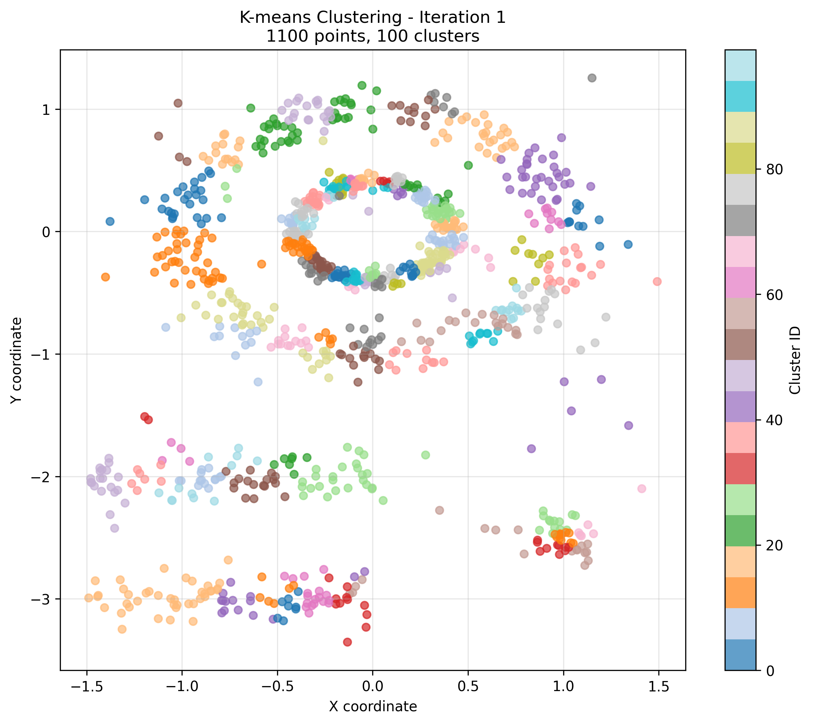
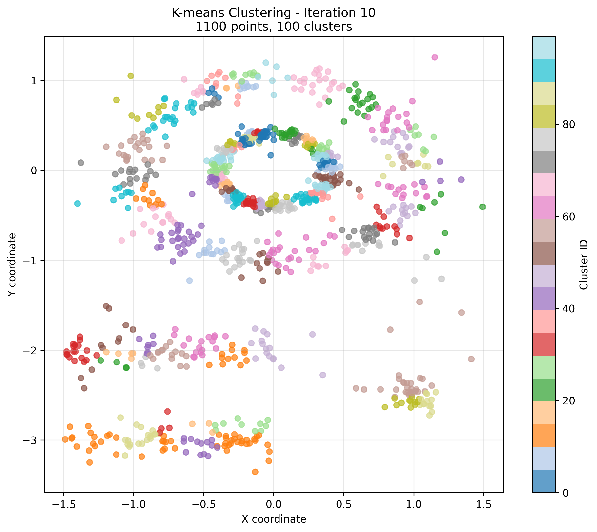
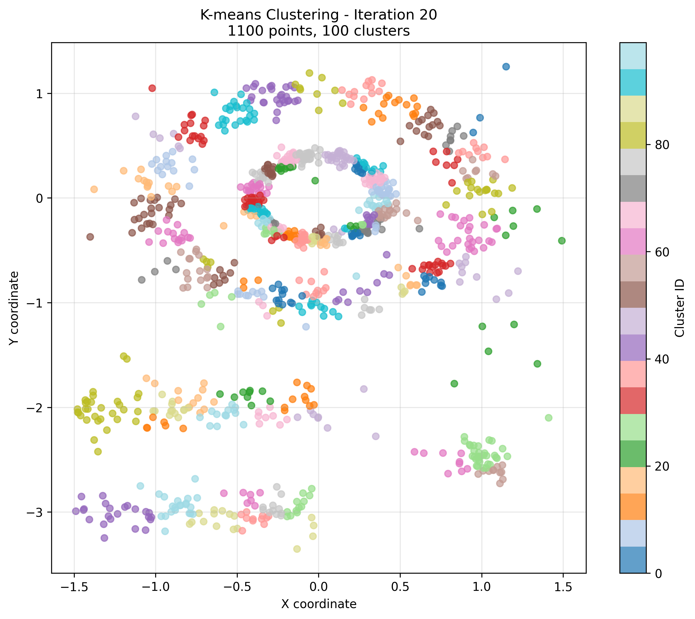
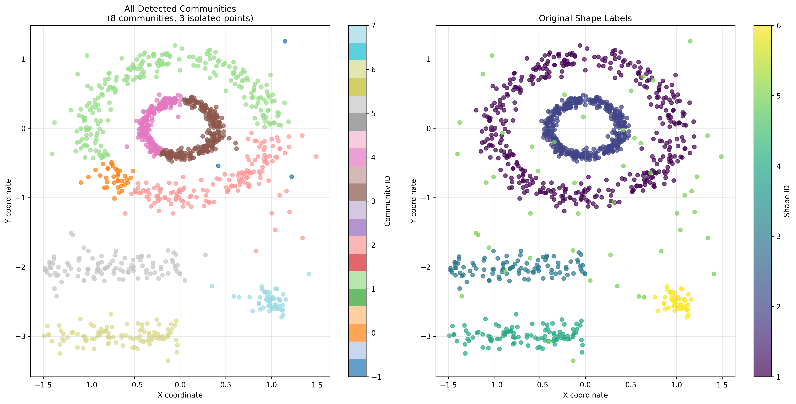

# K-means Community Detection Analysis Results

## Overview

This analysis implements community detection by exploiting the instability of k-means clustering across multiple iterations. The methodology leverages the fact that while individual k-means runs produce variable cluster assignments, truly related data points will consistently cluster together, revealing underlying community structure through co-occurrence patterns.

## Methodology

### 1. Iterative K-means Clustering (`00_iteration_k_means.py`)
- **Dataset**: multishapes.csv with 1,100 data points across 6 different shapes
- **Parameters**: k=100 clusters, 100 iterations
- **Output**: 110,000 rows (1,100 points × 100 iterations) with clustering assignments

### 2. Iteration Visualization (`01_plot_iterations.py`)
- Visualized clustering results for iterations 1, 10, and 20
- Generated both comparison and individual plots showing cluster assignments

Individual iteration results:
- 
- 
- 

### 3. Community Detection via Co-occurrence Analysis (`02_apply_community_detection.py`)
- **Co-occurrence Threshold**: 50+ iterations (≥50% of all iterations)
- **Self-join Analysis**: Identified 775,135 co-clustered pairs across all iterations
- **Strong Pairs**: 5,865 pairs that co-occurred in ≥50 iterations
- **Graph Construction**: Built network from strong pairs using NetworkX
- **Community Detection**: Applied connected components algorithm

#### Key Findings:
- **Total unique pairs**: 31,384 pairs co-clustered at least once
- **Strong pairs**: 5,865 pairs (≥50 co-occurrences)
- **Shape consistency**: 91.1% of co-clustered pairs have the same shape
- **Communities detected**: 8 distinct communities

### 4. Community Visualization (`03_visualize_communities.py`)

## Analysis Insights

### 1. Algorithm Comparison
Multiple community detection approaches were tested:

**Connected Components (Final Choice)**:
- **Communities**: 8 (35-236 points each)
- **Coverage**: 99.7% of points assigned
- **Approach**: Simple, deterministic - any co-clustering relationship creates edges
- **Result**: Clean, interpretable boundaries close to original 6 shapes

**Louvain with Various Resolutions**:
- **High resolution (1.5)**: 32 communities - over-segmented
- **Low resolution (0.2)**: 17 communities - better but still fragmented
- **Medium resolution (1.0)**: Variable results, non-deterministic

**Adaptive Thresholds**:
- **Concept**: Point-specific thresholds based on individual stability patterns
- **Connected Components**: 2 massive communities (too permissive)
- **With Louvain**: 16 communities (over-segmented)

### 2. Key Finding: Simplicity Wins
The straightforward connected components approach with fixed threshold=50 consistently outperformed more sophisticated methods:
- **Deterministic**: Same results every run
- **Interpretable**: Clear logic - co-cluster ≥50 times → same community  
- **Effective**: 8 communities closely match the 6 original shapes
- **Robust**: Focus on edge creation rather than complex optimization

### 3. Shape Consistency
The high percentage (91.1%) of same-shape pairs in co-clustered relationships confirms:
- K-means instability reveals true underlying structure
- Points from the same shape naturally cluster together across iterations
- Dense borders between communities indicate meaningful boundaries

### 4. Community Quality
- **Optimal granularity**: 8 communities vs 6 original shapes provides meaningful subdivision
- **High coverage**: 99.7% of points assigned to communities
- **Balanced sizes**: Range from 35-236 points, no single dominant community
- **Spatial coherence**: Communities maintain natural shape boundaries

## Conclusion

The iterative k-means approach with connected components community detection successfully identified 8 meaningful communities in the multishapes dataset. Key insights:

1. **Edge creation is paramount**: Getting the right co-clustering relationships matters more than sophisticated community algorithms
2. **Simplicity over complexity**: Connected components outperformed Louvain and adaptive methods
3. **Deterministic reliability**: Fixed thresholds provide consistent, interpretable results
4. **Natural boundary detection**: Dense co-clustering borders reveal true community structure

This methodology demonstrates that exploiting k-means instability through simple graph-based approaches can effectively reveal underlying data structure without complex parameter tuning.